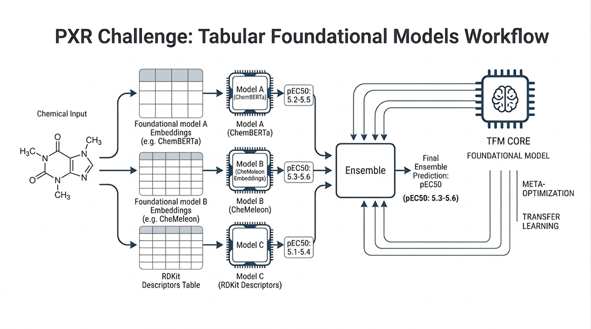

# PXR Challenge Model Lab

Focused workspace for OpenADMET PXR challenge experiments, with the current emphasis on the **activity track**, `uv`-managed environments, and notebook-first iteration.



[](./pyproject.toml)
[](https://github.com/astral-sh/uv)
[](./notebooks/fm_activity_prediction.ipynb)
[](./notebooks/activity_prediction.ipynb)

## What This Repo Is

This repository started from the OpenADMET PXR tutorial setup and has been reshaped into a compact experiment lab for:

- activity prediction notebooks and submission generation
- structure-track example workflows
- local validation and evaluation utilities
- foundation-model feature experiments for small-molecule activity prediction

The center of gravity is now [`notebooks/fm_activity_prediction.ipynb`](./notebooks/fm_activity_prediction.ipynb), which extends the original TabICL workflow with modern molecular embeddings.

## Current Notebook Set

| Notebook | Purpose |
| --- | --- |
| [`notebooks/fm_activity_prediction.ipynb`](./notebooks/fm_activity_prediction.ipynb) | Current activity-track notebook. Uses `TabICLRegressor` over RDKit 2D descriptors plus foundation-model blocks from CheMeleon, ChemBERTa, and MoLFormer. Uses scaffold-grouped CV, reports `RAE`, `MAE`, `R2`, `Spearman`, and `Kendall`, and writes `outputs/my_fm_activity_submission.csv`. |
| [`notebooks/tabfm_activity_prediction.ipynb`](./notebooks/tabfm_activity_prediction.ipynb) | Earlier TabICL activity notebook with the original descriptor workflow. Useful as a reference point for the evolution of the activity experiments. |
| [`notebooks/activity_prediction.ipynb`](./notebooks/activity_prediction.ipynb) | Simpler LightGBM baseline notebook for the activity track. |
| [`notebooks/structure_prediction.ipynb`](./notebooks/structure_prediction.ipynb) | Structure-track tutorial notebook and submission example. |

## Activity Modeling Stack

The current activity notebook uses:

- `TabICLRegressor` as the main tabular foundation model
- `LightGBM` in the simpler baseline notebook
- `RDKit 2D` descriptors as a compact classical feature block
- `CheMeleon` fingerprints via [`chemeleon_fingerprint.py`](./chemeleon_fingerprint.py), adapted from [`JacksonBurns/chemeleon`](https://github.com/JacksonBurns/chemeleon)
- `DeepChem/ChemBERTa-77M-MTR`
- `ibm-research/MoLFormer-XL-both-10pct`
- fused multi-block feature views combining multiple descriptor families

In the current setup, Morgan fingerprints are retained only for similarity diagnostics and fold analysis, not as training descriptors in the foundation-model notebook.

## Environment

The repo is expected to run from a `uv` environment rooted in `.venv`.

### Install

```bash
uv sync
```

Install notebook test dependencies when needed:

```bash
uv sync --group test
```

### Launch Jupyter

Recommended:

```bash
uv run jupyter lab
```

If you prefer to use an existing Jupyter installation, register the repo kernel first:

```bash
uv run python -m ipykernel install --user --name moltabfm-pxr --display-name moltabfm-pxr-.venv
```

Then select the `moltabfm-pxr-.venv` kernel in the notebook UI.

## First-Run Downloads

Some notebooks pull model assets on first use:

- activity tables are loaded from the Hugging Face dataset [`openadmet/pxr-challenge-train-test`](https://huggingface.co/datasets/openadmet/pxr-challenge-train-test)
- ChemBERTa and MoLFormer weights are downloaded through `transformers`
- CheMeleon downloads its published checkpoint into `~/.chemprop/`

The foundation-model notebook caches computed embedding matrices under `outputs/fm_embedding_cache/` so reruns do not recompute them.

`transformers` is pinned in [`pyproject.toml`](./pyproject.toml) because the MoLFormer remote-code path currently expects a 4.x release.

## Validation And Testing

Run notebook integration checks with:

```bash
uv run pytest -n=auto --nbmake --nbmake-timeout=1200 --maxfail=0 --disable-warnings notebooks/
```

Submission and scoring utilities live in:

- [`validation/activity_validation.py`](./validation/activity_validation.py)
- [`validation/structure_validation.py`](./validation/structure_validation.py)
- [`evaluation/`](./evaluation)

## Repository Layout

| Path | Purpose |
| --- | --- |
| [`notebooks/`](./notebooks) | Tutorial and experiment notebooks. These are also the main CI surface. |
| [`inputs/`](./inputs) | PXR structure/protein reference assets used by the structure workflow. |
| [`outputs/`](./outputs) | Example submissions and generated artifacts. Only intentional examples should be committed. |
| [`validation/`](./validation) | Submission-format and chemistry validation helpers. |
| [`evaluation/`](./evaluation) | Scoring code for challenge outputs. |
| [`ACTIVITY_MODEL_GUIDE.md`](./ACTIVITY_MODEL_GUIDE.md) | Notes on the activity modeling strategy and iteration direction. |
| [`pyproject.toml`](./pyproject.toml) | Source of truth for the `uv` environment. |
| [`environment.yaml`](./environment.yaml) | Legacy Conda environment definition. |

## Practical Notes

- Run notebooks from the repo root or through `uv run jupyter lab`.
- The current foundation-model notebook expects to run inside the repo `.venv`.
- The activity notebook includes an optional API submission cell; fill in the required metadata before enabling real submissions.
- Generated outputs such as `outputs/my_fm_activity_submission.csv` are local artifacts unless you intentionally want them versioned.

Built here with good vibes. Thank you Codex and Claude. 🫶🙂

## Origin

This repo is based on the OpenADMET tutorial project: [`OpenADMET/PXR-Challenge-Tutorial`](https://github.com/OpenADMET/PXR-Challenge-Tutorial), but it now reflects a more opinionated local experiment setup focused on reproducible notebook workflows and foundation-model feature experiments.
